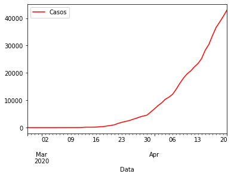
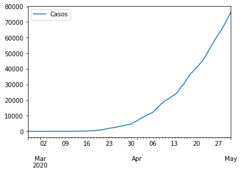

# Data Science Com Base De Covid19

Um programa simples feito para prever o número de casos de pessoas infectadas por coronavírus tanto por país quanto mundialmente.
Foi feito para a avaliação N1 do professora Lucília da Puc Goiás da disciplina de Tecnologia e Construção de Software.

# Exemplo

<h3>Situação atual de casos no Brasil até a última data presente no banco de dados</h3>

<h3>Situação prevista de casos</h3>

